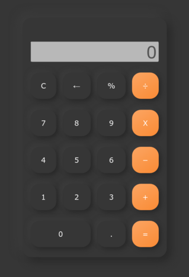

# NeuCalc

A simple calculator written in vanilla javascript with a neumorphism style. I got inspired by this design: [sinthaistudio
](https://www.instagram.com/p/CV69PPylQJw/?utm_medium=copy_link).

